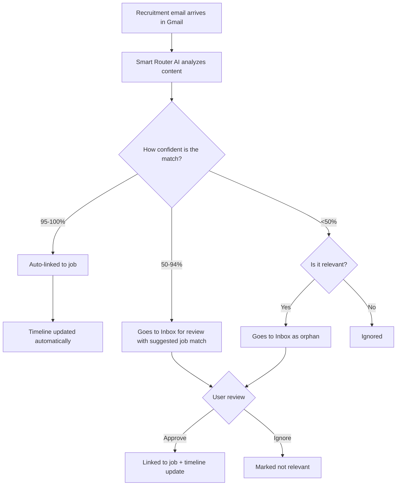

The easiest way to run Meow AI is via Docker Compose. The app is self-configuring and guides you through setup on first launch.

## Prerequisites

- Docker Desktop or Docker Engine + Compose v2

## 1) Start the stack

Example Docker Compose file:

```yaml
---
services:
  meow-ai:
    build:
      context: .
      dockerfile: Dockerfile
      secrets:
        - github_token
    image: ghcr.io/Proga97/job_search_AI:latest
    container_name: meow-ai
    ports:
      - "3005:3001"
    volumes:
      # Persist database and generated PDFs
      - ./data:/app/data
      # Persist Codex login/session data for app-server provider
      - codex-home:/app/codex-home
    environment:
      # Server config
      - NODE_ENV=production
      - PORT=3001

      # Python path (uses system python in container)
      - PYTHON_PATH=/usr/bin/python3
      # Codex runtime home (stores auth and config)
      - CODEX_HOME=/app/codex-home

    env_file:
      - path: ./.env
        required: false
    develop:
      watch:
        # Rebuild container when package.json changes
        - path: ./orchestrator/package.json
          action: rebuild
        - path: ./orchestrator/package-lock.json
          action: rebuild
        # Sync source code changes and rebuild inside container
        - path: ./orchestrator/src
          target: /app/orchestrator/src
          action: sync+restart
        - path: ./visa-sponsor-providers
          target: /app/visa-sponsor-providers
          action: sync+restart
        - path: ./career-boards/bamboohr/src
          target: /app/career-boards/bamboohr/src
          action: sync+restart
        - path: ./career-boards/workday/src
          target: /app/career-boards/workday/src
          action: sync+restart
        # Sync extractor changes
        - path: ./extractors/gradcracker/src
          target: /app/extractors/gradcracker/src
          action: sync+restart
        - path: ./extractors/hiringcafe/src
          target: /app/extractors/hiringcafe/src
          action: sync+restart
        - path: ./extractors/ukvisajobs/src
          target: /app/extractors/ukvisajobs/src
          action: sync+restart
        - path: ./extractors/workingnomads/src
          target: /app/extractors/workingnomads/src
          action: sync+restart
        - path: ./extractors/golangjobs/src
          target: /app/extractors/golangjobs/src
          action: sync+restart
        - path: ./extractors/jobindex/src
          target: /app/extractors/jobindex/src
          action: sync+restart
        - path: ./extractors/seek/src
          target: /app/extractors/seek/src
          action: sync+restart
        - path: ./extractors/jobspy
          target: /app/extractors/jobspy
          action: sync+restart
        - path: ./extractors/naukri
          target: /app/extractors/naukri
          action: sync+restart
        - path: ./extractors/fiveamsat
          target: /app/extractors/fiveamsat
          action: sync+restart
        - path: ./extractors/wazzuf
          target: /app/extractors/wazzuf
          action: sync+restart
    restart: unless-stopped
    healthcheck:
      test: ["CMD", "curl", "-f", "http://localhost:3001/health"]
      interval: 30s
      timeout: 10s
      retries: 3
      start_period: 10s

secrets:
  github_token:
    environment: GITHUB_TOKEN

volumes:
  codex-home:
```

No environment variables are required to boot.

```bash
docker compose up -d
```

This pulls the pre-built image from GHCR and starts the API, UI, and scrapers in one container.

To build locally instead:

```bash
docker compose up -d --build
```

If GitHub rate limits the Camoufox download during local builds, set an
optional `GITHUB_TOKEN` in your shell or `.env` first:

```bash
echo "GITHUB_TOKEN=ghp_your_token_here" >> .env
docker compose up -d --build
```

Meow AI passes this token to the Docker build as a BuildKit secret only for the
Camoufox download step. It is not stored in the runtime container
environment.

## 2) Access the app and onboard

Open:

- **Dashboard**: `http://localhost:3005`

The onboarding flow saves three durable setup decisions:

1. **Workspace account**: On brand-new installs, create the first username/password account directly in onboarding. This first account becomes the system admin and owns the initial private workspace.
2. **Search preferences**: Save your country, optional preferred cities, workplace style, and whether you need visa sponsorship. Meow AI applies these values as defaults for future runs and sponsor-aware features.
3. **LLM provider**: Choose OpenRouter by default, or connect another supported hosted or local provider. The step completes only after the server verifies and persists the connection.
4. **Resume review**: Upload a PDF/DOCX/Reactive Resume JSON, or connect Reactive Resume. Meow AI shows the parsed resume and requires confirmation of the current document before setup completes.

Search terms are not part of onboarding. Choose or edit them when starting your first run.

Settings and user accounts are saved to the local database. If you are upgrading an older single-user install, Meow AI migrates existing rows into one default private workspace. When `BASIC_AUTH_USER` and `BASIC_AUTH_PASSWORD` are present during that migration, they seed the first system admin account; otherwise onboarding requires first-run account setup before private APIs are usable.

System admins can create more users from **Settings → Environment & Workspaces**. Each created user receives a separate private workspace with isolated jobs, settings, resumes, integrations, PDFs, pipeline runs, chat, analytics, and post-application data.

## Hosted single-tenant mode

Meow AI defaults to local/self-hosted mode when hosted flags are unset. Hosted mode is an env-gated deployment mode for running one configured tenant with multiple users in that tenant.

To enable hosted mode, set:

```bash
JOBOPS_APP_MODE=hosted
JOBOPS_HOSTED_TENANT_ID=tenant_hosted
```

`JOBOPS_HOSTED_TENANT_ID` is required in hosted mode. Meow AI fails startup if `JOBOPS_APP_MODE=hosted` is set without a hosted tenant ID. The tenant must already exist in the database before hosted signup can create users for it; hosted signup does not create tenants.

Optional hosted capabilities default to disabled:

```bash
JOBOPS_HOSTED_SIGNUPS_ENABLED=false
JOBOPS_HOSTED_PLATFORM_LLM_ENABLED=false
JOBOPS_HOSTED_QUOTAS_ENABLED=false
```

These flags only affect hosted mode. Leaving `JOBOPS_APP_MODE` unset keeps the current first-run setup, private-workspace user creation, settings, and local behavior unchanged.

When hosted mode is active, first-run setup is disabled. Hosted users must be created through hosted signup when `JOBOPS_HOSTED_SIGNUPS_ENABLED=true`, or by a later tenant-owner/admin user-management flow. Hosted signup appears on `/sign-in` as a **Create account** tab only when hosted mode and hosted signups are both enabled.

## Codex sign-in

For full Codex auth troubleshooting (including device-code authorization errors), see:

- [Codex Authentication](/docs/next/getting-started/codex-auth)

## Gmail OAuth (Tracking Inbox)

If you want Gmail integration, configure OAuth credentials.

### 1) Create Google OAuth credentials

In Google Cloud:

1. Configure OAuth consent screen.
2. Enable Gmail API.
3. Create OAuth client ID (`Web application`).
4. Add redirect URI:
  - `http://localhost:3005/oauth/gmail/callback`
  - Or your production URL, for example `https://your-domain.com/oauth/gmail/callback`

### 2) Configure environment variables

- `GMAIL_OAUTH_CLIENT_ID` (required)
- `GMAIL_OAUTH_CLIENT_SECRET` (required)
- `GMAIL_OAUTH_REDIRECT_URI` (optional, recommended in production)

### 3) Restart and connect

- Restart container
- Open Tracking Inbox and click **Connect Gmail**

For a full step-by-step setup, exact scope requirements, and troubleshooting, see:

- [Gmail OAuth Setup](/docs/next/getting-started/gmail-oauth-setup)

## Email-to-job matching overview



## Persistent data

`./data` bind-mount stores:

- SQLite DB: `data/jobs.db`
- Generated PDFs: `data/pdfs/`
- Cloudflare challenge cookies: `data/cloudflare-cookies/`

## Public demo mode

Set `DEMO_MODE=true` for sandbox deployments.

Behavior in demo mode:

- Anonymous read-only access to the seeded demo workspace
- Works locally: browsing/filtering/viewing timelines
- Simulated: pipeline run/summarize/process/rescore/pdf/apply
- Blocked: settings writes, DB clear, backups
- Disabled: first-run account setup
- Auto-reset: every 6 hours

## Updating

```bash
git pull
docker compose pull
docker compose up -d
```

## Self-hosted Reactive Resume

If you self-host Reactive Resume, set:

- `RXRESUME_URL=http://rxresume.local.net`
- `RXRESUME_API_KEY=...` (or configure `rxresumeApiKey` in Meow AI Settings)


## Local PDF rendering

Meow AI supports 3 PDF renderers:

- `rxresume`: export the final PDF through RxResume
- `latex`: render locally from tailored resume data using LaTeX and `tectonic`
- `typst`: render locally from tailored resume data using Typst and a selectable theme

When using local renderers:

- The Docker image installs `tectonic` and `typst` for you.
- For non-Docker local runs, install `tectonic` yourself and optionally set `TECTONIC_BIN` if it is not on your `PATH`.
- For non-Docker local runs with Typst, install `typst` yourself and optionally set `TYPST_BIN` if it is not on your `PATH`.

RxResume remains the source of truth for base resume data, project visibility, and tailoring inputs when importing from Reactive Resume. Local renderers use the structured Design Resume data at render time.
